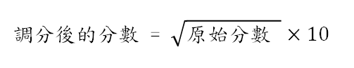

# 引入模組+格式化輸出 #

## 說明 ##

台北市公館大學某系某科的段考特別難，老師決定幫大家調分，調分規則如下：<br>
<b>原始分數開根號乘以10</b><br>

<br>
使用者輸入分數，並列印出原始分數以及調分後的分數<br>
<br>

## Input Format ##

整數(int)或幅點數(float)<br>

## Output Format ##

Original: 分數                            (小數點後2位)<br>
Adjusted: 分數(+差幾分(四捨五入至整數))   (小數點後2位)<br>

## Sample Input 1 ##
```
36
```

## Sample Output 1 ##
```
Original: 36.00
Adjusted: 60.00(+24)
```

## Sample Input 2 ##
```
50
```

## Sample Output 2 ##
```
Original: 50.00
Adjusted: 70.71(+21)
```
## Hint ##

```
1. 引入math模組來計算根號 math.sqrt()
```
